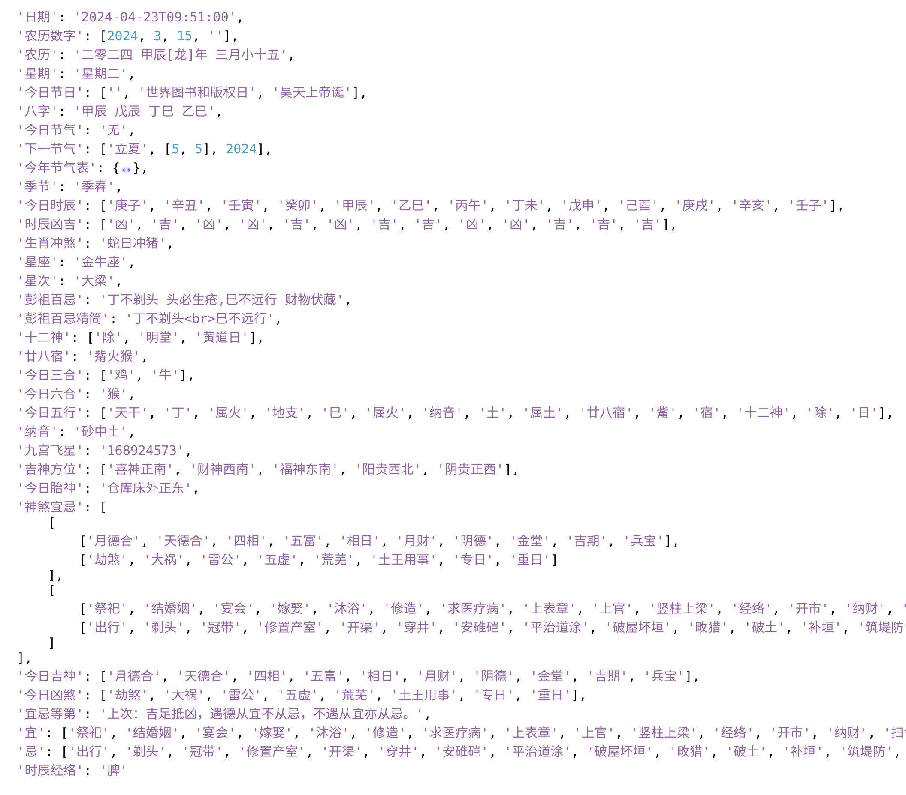

# 中国传统农历日历
> 因为最近工作需要，需要实现传统农历里的像吉凶宜忌的功能，在翻github的时候找到了一个不错的项目，于是就将其封装成api,
> 
```bash
curl -X 'POST' \
  'http://127.0.0.1:8080/api/lunar' \
  -H 'accept: application/json' \
  -H 'Content-Type: application/json' \
  -d '{
      "year": 2024,
      "month": 4,
      "day": 23,
      "hour": 9,
      "minute": 51
  }'
```


> python调用方式也可以参考目录下的test.py

 

> 信息还是很丰富的，就是有的看的不太明白
> 
> 原项目地址[github地址](https://github.com/OPN48/cnlunar.git)
> 


## 使用方式一：python虚拟环境
> 安装 miniconda/anaconda

```bash
#clone项目
git clone https://github.com/a-zhui/chinese_lunar_api.git

cd chinese_lunar_api #进入项目根目录

```

```bash
#构建虚拟环境
conda create -n chinese_lunar_api python=3.10
conda activate chinese_lunar_api
pip install -r requirements.txt

```

```bash
#启动服务
uvicorn --host 0.0.0.0 --port 7860 api:api
```


## 使用方式二：docker
```bash
#阿里云镜像
docker run -it -d -p 8080:7860 --restart always --name chinese_lunar registry.cn-hangzhou.aliyuncs.com/bocai123/chinese_lunar:1.0 
```